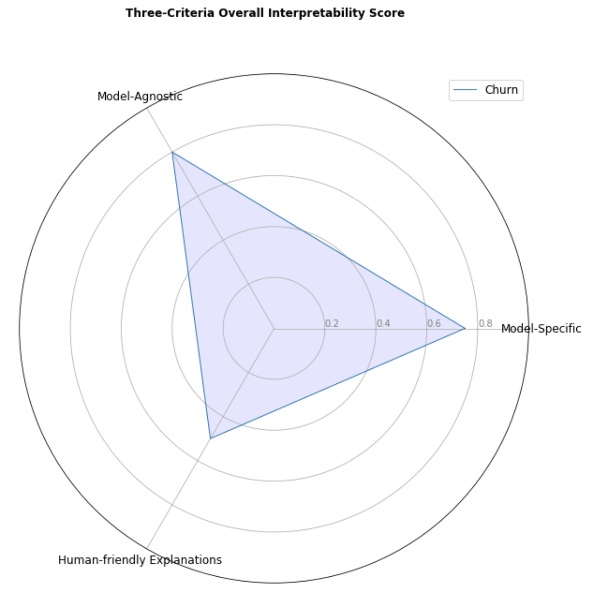
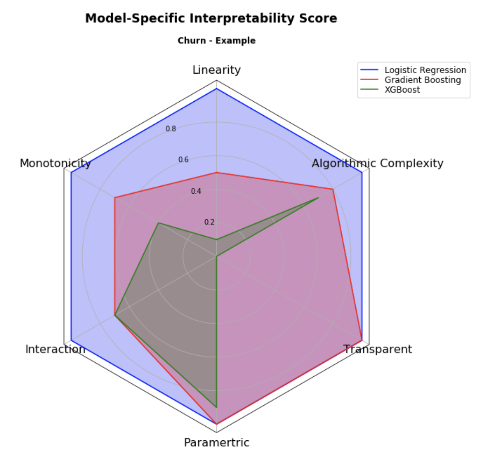
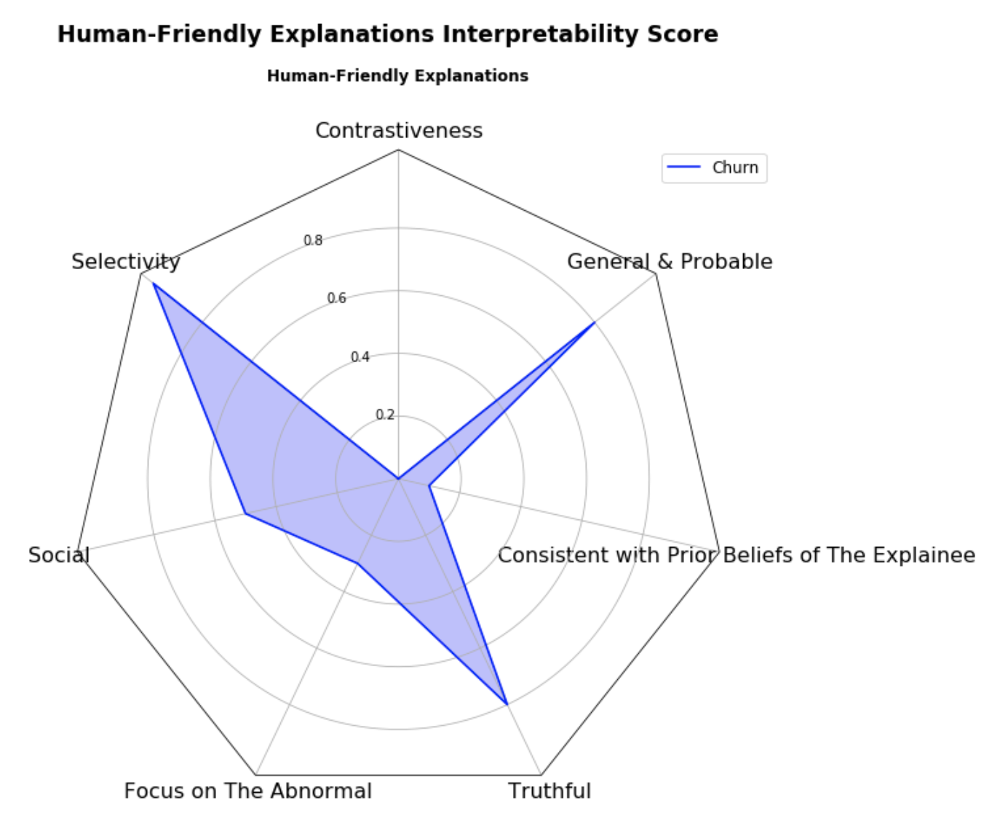

# 5.3 Results & Explanation

## 5.3.1 Score Table

According to our Evaluation System, we can easily get the score tables of _the Churn Notebook_ from the three criteria:

### 5.3.1.1 Interpretable Model / Model-Specific

The table below is scored based on the properties specific to the models that were generated based on the algorithms in the notebook. 

**Ex:** GBM scores 0.5 for the Linearity, because, it shows no-linearity as well as linearity as it is usually considered for classification as well as continous distribution problems to address.

Similarly, XGBoost has been scored 0.1 as it shows no leanierity in any aspect, the reason being it to be a tree based model.

| Algorithm/Property | Linearity | Monotonicity | Interaction | Parametric | Transparent | Algorithmic complexity |
| :--- | :--- | :--- | :--- | :--- | :--- | :--- |
| **Logistic Regression** | 1 | 1 | 1 | 1 | 1 | 1 |
| **Gradient Boosting** | 0.5 | 0.7 | 0.7 | 1 | 1 | 0.8 |
| **XGBoost** | 0.1 | 0.4 | 0.7 | 0.9 | 0 | 0.7 |

### 5.3.1.2 Model-Agnostic

The table below is scored based on the Model-agnostic methods used in the notebook, in the previous chanpter.

**Ex:** Variable Importance, being one of the method has been scored 1 for Feature Symmary, becuase it provides the user the information about a specific feature when tried to interprete.

Similarly, an another explanation for the scor would be - PDP has been scored 0.9 for the Datapoint due to the plot consisting data to be plotted over the graph and giving the user a visual representaion of how the feature would vary to the target as the feature inreases.

| Method/Property | Feature summary | Model internals | Datapoint | A Surrogate intrinsically interpretable model | Expressive power | Portability | Algorithmic complexity | Detailed | Correctness | Consistency | Stability | Certainty | Importance | Novelty | Representativeness |
| :--- | :--- | :--- | :--- | :--- | :--- | :--- | :--- | :--- | :--- | :--- | :--- | :--- | :--- | :--- | :--- |
| **Variable Importance** | 1 | 1 | 0.5 | / | 1 | 1 | 1 | 1 | 1 | 0.3 | 1 | 1 | 1 | 0 | 1 |
| **PDP** | 1 | 0.1 | 0.9 | / | 1 | 1 | 0.9 | 0.5 | 1 | 0.8 | 1 | 0.8 | 0.8 | 1 | 0.1 |
| **ICE** | 1 | 0.2 | 1 | / | 1 | 0.5 | 0.5 | 1 | 1 | 0.8 | 1 | 0.9 | 1 | 0.9 | 0.1 |

### 5.3.1.3 Human-friendly Explanation

We have score the notebook based on the Human Friendly Explanations that can be infered from the Notebook. We hav tried to score them based on the definations givined under the [**Ch. 4.2.3**](../4.-evaluation-system-of-interpretable-machine-learning/4.2.1-the-structure-of-the-evaluation-system/4.2.4-human-explanations.md)**.**

| Model/Property | Contrastiveness | Selectivity | Social | Focus on the abnormal | Truthful | Consistent with prior beliefs of the explainer | General and probable |
| :--- | :--- | :--- | :--- | :--- | :--- | :--- | :--- |
| **Churn** | 0 | 1 | 0.5 | 0.3 | 0.8 | 0.1 | 0.8 |

## 5.3.2 Radar Charts

### 5.3.2.1 Overall Score

### 5.3.2.2 Model-Specific Score

### 5.3.2.3 Model-Agnostic Score

### 5.3.2.4 Human-Friendly Explanation Score

